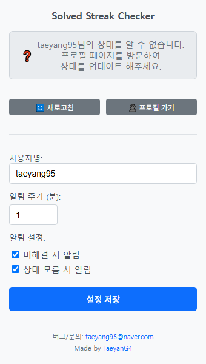

# Solved Streak Checker (솔브드 스트릭 체커)

 

지정한 solved.ac 사용자의 스트릭(잔디) 상태를 주기적으로 확인하고, 설정에 따라 데스크톱 알림을 보내주는 Chrome 확장 프로그램입니다. 꾸준한 문제 해결 습관을 유지하는 데 도움을 줍니다.

---

**목차**

* [주요 기능](#주요-기능)
* [스크린샷](#스크린샷) <Badge text="나중에 추가하세요" type="info"/>
* [설치 방법](#설치-방법)
* [사용 방법](#사용-방법)
* [기술적인 세부 정보](#기술적인-세부-정보)
    * [작동 방식](#작동-방식)
    * [주의: CSS 선택자](#주의-css-선택자)
* [알려진 문제 및 한계](#알려진-문제-및-한계)
* [라이선스](#라이선스)
* [연락처 및 기여자](#연락처-및-기여자)

---

## 주요 기능

* **특정 사용자 지정:** solved.ac 사용자명을 지정하여 해당 사용자의 스트릭 상태를 추적합니다.
* **스트릭 상태 모니터링:** 지정된 사용자의 프로필 페이지 정보를 바탕으로 가장 최근 활동일의 문제 해결 여부(풀었음 ✅, 안 풀었음 ❌, 상태 모름 ❓)와 현재 스트릭 일수를 확인합니다. (스트릭 일수는 페이지 구조상 확인 가능한 경우에만 표시됩니다).
* **팝업 UI 제공:**
    * 확장 프로그램 아이콘 클릭 시, 마지막으로 확인된 스트릭 상태, 현재 스트릭 일수, 마지막 확인 시간을 보여줍니다.
    * 팝업 내에서 대상 사용자명, 상태 확인 주기(분 단위), 알림 수신 옵션(미해결 시, 상태 모름 시)을 쉽게 설정하고 저장할 수 있습니다.
    * '새로고침' 버튼으로 백그라운드에 저장된 최신 상태를 즉시 다시 불러와 팝업에 표시합니다.
    * '프로필 가기' 버튼으로 해당 사용자의 solved.ac 프로필 페이지를 새 탭에서 빠르게 열 수 있습니다.
* **데스크톱 알림:**
    * 설정한 주기마다 백그라운드에서 저장된 스트릭 상태를 확인합니다.
    * '가장 최근 활동일에 풀지 않음' 상태일 때 알림을 받을지 선택할 수 있습니다. (기본값: 받음)
    * '스트릭 상태를 알 수 없음' 상태일 때 알림을 받을지 선택할 수 있습니다. (기본값: 받음)
    * 알림에는 해당 사용자의 프로필 페이지로 바로 이동하는 "프로필 확인하기" 버튼이 포함됩니다.
    * 알림은 사용자가 직접 닫거나 버튼을 클릭하기 전까지 유지됩니다 (`requireInteraction: true` 사용).
* **자동 상태 초기화:** 매일 오전 6시(사용자 로컬 시간 기준)에 저장된 '마지막 스트릭 상태(`lastStreakStatus`)'를 '상태 모름(null)'으로 자동 초기화하여, 날짜 변경 후 새로운 상태를 정확히 반영하도록 돕습니다.
* **설정 동기화:** Chrome 계정에 로그인되어 있다면, 사용자 설정값 (`targetUsername`, `alarmInterval`, `notifyOnNotSolved`, `notifyOnUnknown`)이 여러 기기 간에 동기화될 수 있습니다 (`chrome.storage.sync` 사용). 마지막 스트릭 상태(`lastStreakStatus` 등)는 로컬에 저장됩니다 (`chrome.storage.local`).

---

## 스크린샷

* **팝업 - 초기 설정 화면:** 사용자명을 입력하기 전의 모습
  

* **팝업 - 문제 해결 상태:** 가장 최근 활동일에 문제를 푼 것으로 확인된 경우
  

* **팝업 - 문제 미해결 상태:** 가장 최근 활동일에 문제를 풀지 않은 것으로 확인된 경우
  

* **팝업 - 상태 모름:** 스트릭 상태를 확인할 수 없는 경우 (프로필 미방문 등)
  

* **데스크톱 알림 예시:** '미해결' 또는 '상태 모름' 시 나타나는 알림
  

---

## 설치 방법

### 방법 1: Chrome 웹 스토어 (권장 - 게시 준비 시)

1.  [Solved Streak Checker Chrome 웹 스토어 링크] <Badge text="게시 후 링크 추가" type="warning"/>
2.  **Chrome에 추가** 버튼을 클릭하여 설치합니다.

### 방법 2: 수동 설치 (개발자 모드)

1.  이 저장소의 코드를 다운로드합니다.
    * 오른쪽 상단의 'Code' 버튼 -> 'Download ZIP' 클릭 후 압축 해제.
    * 또는 Git 사용 시: `git clone https://github.com/TaeyanG4/Solved-Streak-Checker.git` (실제 저장소 URL로 가정)
2.  Chrome 브라우저를 열고 주소창에 `chrome://extensions` 를 입력하여 확장 프로그램 관리 페이지로 이동합니다.
3.  페이지 우측 상단의 **개발자 모드(Developer mode)** 토글 스위치를 켭니다.
4.  **압축해제된 확장 프로그램을 로드합니다(Load unpacked)** 버튼을 클릭합니다.
5.  파일 탐색기가 열리면, 1단계에서 다운로드하거나 압축 해제한 **확장 프로그램 폴더 전체** (내부에 `manifest.json` 파일이 있는 폴더)를 선택합니다.
6.  확장 프로그램 목록에 "Solved Streak Checker"가 추가되고 활성화되면 설치가 완료된 것입니다.

---

## 사용 방법

1.  확장 프로그램을 설치합니다. (위 [설치 방법](#설치-방법) 참고)
2.  Chrome 툴바에서 **Solved Streak Checker 아이콘** (solved.ac 로고 모양의 아이콘)을 클릭하여 팝업 창을 엽니다.
3.  **사용자명** 입력 필드에 스트릭 상태를 확인하고 싶은 solved.ac 사용자명을 정확히 입력합니다.
4.  **알림 주기 (분)** 입력 필드에서 백그라운드가 저장된 상태를 확인하고 알림을 보낼 주기를 분 단위로 설정합니다. (기본값: 1분. 너무 짧으면 불필요한 확인이 잦을 수 있으니 **5분 ~ 15분** 사이를 권장합니다.)
    * **주의:** 이 주기는 백그라운드에서 *저장된 상태*를 확인하는 주기이며, 실제 스트릭 상태 정보 자체는 아래 7번 단계처럼 해당 프로필 페이지를 방문해야 업데이트됩니다.
5.  **알림 설정**에서 원하는 옵션을 체크합니다.
    * `미해결 시 알림`: 가장 최근 활동일에 문제를 풀지 않았을 경우(`❌` 상태) 알림을 받습니다.
    * `상태 모름 시 알림`: 스트릭 상태를 알 수 없을 경우(`❓` 상태) 프로필 페이지 방문을 유도하는 알림을 받습니다.
6.  **설정 저장** 버튼을 클릭합니다. "설정이 저장되었습니다!" 메시지가 나타납니다.
7.  **⭐ 중요 ⭐:**
    * **처음 설정을 저장한 후에는, 반드시 해당 사용자의 solved.ac 프로필 페이지 (`https://solved.ac/profile/입력한_사용자명`)를 한 번 이상 방문해야 합니다.**
    * **매일 오전 6시 이후** 상태가 '상태 모름'으로 초기화된 뒤에도, **그날의 정확한 스트릭 상태를 확인하려면 프로필 페이지를 방문해야 합니다.**
    * 이 과정을 통해 `content.js`가 실행되어 실제 스트릭 상태(색상, 일수)를 읽어오고 백그라운드 스크립트로 전송하여 상태를 업데이트할 수 있습니다.
8.  이후 팝업 창을 열면 마지막으로 확인/저장된 스트릭 상태가 표시됩니다. '새로고침' 버튼으로 팝업 표시를 갱신할 수 있습니다 (백그라운드 데이터 기준).
9.  설정한 알림 조건(`미해결` 또는 `상태 모름`)이 충족되고 설정한 `알림 주기`가 되면 데스크톱 알림이 표시됩니다.

---

## 기술적인 세부 정보

### 작동 방식

이 확장 프로그램은 Chrome 확장 프로그램 Manifest V3 규격을 따르며, 다음과 같은 주요 구성 요소로 작동합니다.

* **`manifest.json`**: 확장 프로그램의 기본 설정(이름, 버전, 설명), 필요한 권한(`scripting`, `alarms`, `notifications`, `storage`), 실행될 스크립트(`content.js`, `background.js`), 팝업 페이지(`popup.html`), 아이콘 등을 정의합니다. `host_permissions`를 통해 `content.js`가 `https://solved.ac/profile/*` 에서 실행될 수 있도록 허용합니다.
* **`popup.html` / `popup.css` / `popup.js`**:
    * 사용자가 확장 프로그램 아이콘을 클릭했을 때 나타나는 팝업 창의 UI(HTML)와 스타일(CSS), 그리고 상호작용 로직(JavaScript)을 담당합니다.
    * `popup.js`는 팝업이 열릴 때 `background.js`에 `requestInitialData` 메시지를 보내 저장된 설정값과 마지막 스트릭 상태를 요청하고, 받아온 데이터로 UI를 업데이트합니다.
    * 사용자 입력(사용자명, 알림 주기, 알림 옵션)을 받아 유효성을 검사한 후, `chrome.storage.sync`에 저장합니다.
    * 상태 표시(아이콘, 메시지, 스트릭 일수, 마지막 확인 시간), 새로고침, 프로필 페이지 이동 기능을 제공합니다.
* **`background.js` (Service Worker)**:
    * 확장 프로그램의 핵심 로직을 백그라운드에서 처리하는 서비스 워커입니다. 이벤트 기반으로 작동합니다.
    * `chrome.alarms` API를 사용하여 두 종류의 알람을 관리합니다:
        * `ALARM_NAME` ('solvedacStreakCheckAlarm'): 사용자가 설정한 `alarmInterval` 주기로 `checkStoredStatusAndNotify` 함수를 호출하여 저장된 상태 기반 알림 조건을 확인합니다.
        * `RESET_ALARM_NAME` ('dailyStatusResetAlarm'): 매일 오전 6시에 `lastStreakStatus`를 `null`로 초기화하고, 다음 날 초기화 알람을 다시 설정합니다.
    * `chrome.storage.sync` (설정값) 및 `chrome.storage.local` (마지막 상태값)을 읽고 씁니다.
    * `chrome.runtime.onMessage` 리스너를 통해 다른 스크립트와 통신합니다:
        * `content.js`로부터 `streakStatusUpdate` 메시지를 받으면, 해당 데이터를 `chrome.storage.local`에 저장하고, 필요한 경우 기존 알림을 제거합니다. (`content.js`에는 응답을 보내지 않음 - `return false`).
        * `popup.js`로부터 `requestInitialData` 메시지를 받으면, `storage.sync`와 `storage.local`에서 데이터를 조합하여 응답으로 보냅니다 (`return true`로 비동기 응답 처리).
    * `chrome.notifications` API를 사용하여 조건에 따라 데스크톱 알림을 생성(`createNotification`)하고, 알림 클릭(`onClicked`) 또는 버튼 클릭(`onButtonClicked`) 시 프로필 페이지를 열고 알림을 닫는 상호작용을 처리합니다.
* **`content.js`**:
    * `manifest.json`에 정의된 대로 `https://solved.ac/profile/*` 패턴과 일치하는 페이지가 로드될 때 (`document_idle` 시점) 실행됩니다.
    * `chrome.storage.sync`에서 `targetUsername`을 가져와 현재 페이지 URL의 사용자명과 비교합니다.
    * 일치하는 경우, 페이지의 DOM(HTML 구조)을 분석하여 **CSS 선택자**를 사용해 스트릭 그래프 요소(`svg rect`)와 스트릭 일수(`div`와 `b` 태그)를 찾습니다.
    * 추출된 정보(해결 여부 `solved`, 사용자명 `username`, 스트릭 일수 `streakCount`, 확인 시각 `timestamp`)를 객체에 담아 `chrome.runtime.sendMessage`를 통해 `background.js`로 전송합니다.
    * 페이지 로딩 및 동적 컨텐츠(SVG 등) 렌더링 시간을 고려하여 `setTimeout`으로 약간의 지연(1.5초) 후 검사를 실행합니다.

### 주의: CSS 선택자

`content.js`는 solved.ac 웹사이트의 특정 HTML 요소와 구조에 의존하여 스트릭 정보를 추출합니다. 코드 내에서는 다음과 같은 CSS 선택자들을 사용합니다 (예시, 실제 값은 코드 확인 필요):

* 스트릭 그래프 사각형: `const STREAK_RECT_SELECTOR = 'svg rect[width="18"][height="18"][rx="5"]';`
* 스트릭 그래프 컨테이너: `document.querySelector('div.css-cssveg svg')`
* 스트릭 일수 관련 요소: `document.querySelectorAll('div.css-1midmz7')` 내부에서 "현재"로 시작하는 텍스트를 찾고, 그 안의 `<b>` 태그에서 숫자 추출

**⚠️ 중요:** 이러한 CSS 선택자들은 **solved.ac 웹사이트의 디자인이나 HTML 구조가 변경되면 더 이상 작동하지 않을 수 있습니다.** 만약 solved.ac 웹사이트 업데이트 이후 스트릭 상태나 일수가 올바르게 감지되지 않는다면 (팝업에 계속 '상태 모름'으로 표시되거나 정보가 부정확하다면), 이는 웹사이트 구조 변경으로 인해 기존 선택자가 더 이상 유효하지 않기 때문일 가능성이 높습니다.

이 경우, Chrome 개발자 도구(페이지에서 F12 키)를 사용하여 변경된 웹사이트 구조를 직접 분석하고, `content.js` 파일 내의 `STREAK_RECT_SELECTOR`와 스트릭 일수를 찾는 로직 (`checkStreakStatus` 함수 내)을 **직접 수정해야 할 수 있습니다.** 이는 웹 페이지 내용을 스크래핑하는 방식에 의존하는 모든 확장 프로그램의 본질적인 한계점입니다.

---

## 알려진 문제 및 한계

* **CSS 선택자의 취약성:** 위에서 상세히 설명했듯이, solved.ac 웹사이트의 HTML 구조 변경 시 스트릭 정보 감지 기능(`content.js`)이 중단될 수 있습니다.
* **초기/매일 상태 확인 필요:** 확장 프로그램 설치 후 처음 사용자 설정을 저장했을 때, 그리고 매일 오전 6시 상태 초기화 이후에는, 사용자가 **직접 해당 solved.ac 프로필 페이지를 방문해야만** 최신 스트릭 상태가 `content.js`에 의해 감지되고 백그라운드에 저장됩니다. 확장 프로그램이 백그라운드에서 자동으로 solved.ac 페이지를 로드하거나 API를 직접 호출하지는 않습니다.
* **상태 정확성:** '가장 최근 활동일'의 해결 여부는 스트릭 그래프 SVG 요소 중 특정 선택자에 맞는 *마지막* `rect` 요소의 `fill` 색상을 기준으로 판단합니다. 이는 일반적으로 '오늘' 또는 가장 최근 활동 기록이 있는 날의 상태를 반영하지만, solved.ac의 그래프 표시 방식이나 사용자의 활동 패턴에 따라 예외적인 경우가 있을 수 있습니다. 스트릭 일수 역시 특정 클래스 이름과 텍스트 패턴에 의존합니다.
* **알림 주기 vs 상태 업데이트 시점:** 팝업에서 설정하는 '알림 주기'는 백그라운드 서비스 워커가 *이미 저장된 상태 값*을 기준으로 알림을 보낼지 말지를 결정하는 주기입니다. 실제 스트릭 상태 값 자체는 `content.js`가 실행될 때, 즉 사용자가 해당 프로필 페이지를 방문했을 때만 업데이트됩니다.